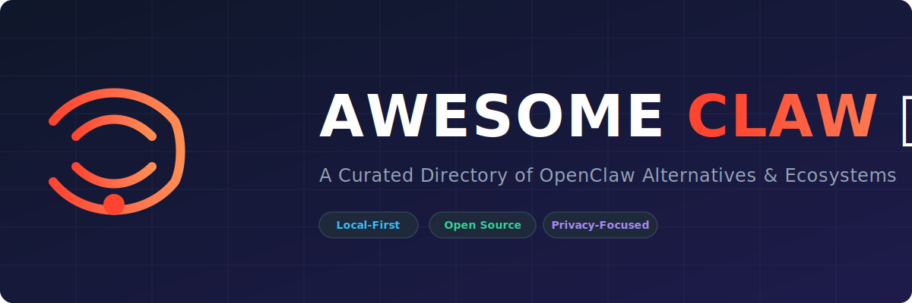

# Awesome Claw 🦞

  

   
 
 

<h1>Curated OpenClaw Alternatives &amp; Local AI Gateways</h1>

> A curated directory of **open-source GitHub projects**, local AI agents, and lightweight gateway alternatives to **[OpenClaw](https://github.com/openclaw/openclaw)**.

## 🔍 Overview

**OpenClaw** is a popular TypeScript gateway for persistent AI agents across messaging applications. This curated repository highlights the best **OpenClaw alternatives** and **ecosystem resources** that support self-hosting, local execution, messaging integrations (like Telegram, WhatsApp, and Discord), with a strong emphasis on privacy, minimal resource footprint, and security.

Whether you need a lightweight Python CLI, a micro-binary written in Rust or Zig, or a container-isolated assistant, this list helps you choose the perfect local AI gateway for your infrastructure.

---

## 📖 Table of Contents
- [🏆 Original](#-original)
- [🤖 Multi-Agent & Specialized](#-multi-agent--specialized)
- [📚 Awesome Lists & Ecosystems](#-awesome-lists--ecosystems)
- [🪶 Lightweight & Minimal](#-lightweight--minimal)
- [🛡️ Secure & Reimplementations](#-secure--reimplementations-rustziggo)
- [🚫 No-LLM / Safe Alternatives](#-no-llm--safe-alternatives)
- [📊 How to Choose](#-how-to-choose)

---

## 🏆 Original

| Project | Description | Stars |
| :--- | :--- | :--- |
| **[OpenClaw](https://github.com/openclaw/openclaw)**  | The full-featured personal AI assistant. Multi-channel messaging, skills, voice, canvas, 24/7 gateway. (TypeScript) | `377k+` |

## 🤖 Multi-Agent & Specialized

*   **[FreeClaw](https://github.com/openconstruct/freeclaw)**   
    *Minimal Python CLI.* NVIDIA NIM / OpenRouter / Groq compatible.

*   **[ClawSwarm](https://github.com/The-Swarm-Corporation/ClawSwarm)**   
    *Multi-agent version.* Built on Swarms framework. Natively multi-agent, Telegram-first, compiles to Rust.

## 📚 Awesome Lists & Ecosystems

*   **[VoltAgent/awesome-openclaw-skills](https://github.com/VoltAgent/awesome-openclaw-skills)**  — 5,400+ skills for the OpenClaw ecosystem.
*   **[rohitg00/awesome-openclaw](https://github.com/rohitg00/awesome-openclaw)**  — Resources, comparisons, tutorials.
*   **[machinae/awesome-claws](https://github.com/machinae/awesome-claws)**  — Curated list of all Claw-inspired agents.
*   **[LAMBDASOFT-org/awesome-openclaw-ecosystem](https://github.com/LAMBDASOFT-org/awesome-openclaw-ecosystem)**  — Infrastructure, tools, and alternative agents.

## 🪶 Lightweight & Minimal

*   **[Nanobot](https://github.com/HKUDS/nanobot)**   
    *Ultra-lightweight Python alternative.* ~4,000 lines, 99% smaller. Easy pip install, 8+ messaging channels, China platform support.

*   **[PicoClaw](https://github.com/sipeed/picoclaw)**   
    *Tiny single-binary Go implementation.* Runs on $10 edge hardware (Raspberry Pi, RISC-V), <10 MB RAM, sub-second startup.

*   **[NullClaw](https://github.com/nullclaw/nullclaw)**   
    *Smallest & fastest.* 678 KB Zig static binary, <2 ms boot, ~1 MB RAM. Zero dependencies, perfect for microcontrollers.

*   **[Mini-Claw](https://github.com/htlin222/mini-claw)**   
    *Minimalist Telegram bot.* Uses Pi agent. No extra API costs — uses your Claude/ChatGPT subscription directly.

## 🛡️ Secure & Reimplementations (Rust/Zig/Go)

*   **[ZeroClaw](https://github.com/zeroclaw-labs/zeroclaw)**   
    *Fast, tiny Rust framework.* <5 MB RAM. Autonomous runtime with model/tool/memory swapping. Excellent for production/low-power.

*   **[NanoClaw](https://github.com/qwibitai/nanoclaw)**   
    *Container-isolated agents.* For true OS-level security. ~500 lines core, WhatsApp + scheduled jobs + memory.

*   **[IronClaw](https://github.com/nearai/ironclaw)**   
    *Rust reimplementation.* Focused on privacy, memory safety, and WASM sandboxing. Full feature parity tracking.

## 🚫 No-LLM / Safe Alternatives

*   **[SafeClaw](https://github.com/princezuda/safeclaw)**   
    *Zero-LLM, rule-based.* Deterministic assistant. No prompt injection risk, text+voice, does ~90% of OpenClaw tasks for free.

*   **[BashClaw](https://github.com/shareAI-lab/bashclaw)**   
    *Pure Bash reimplementation.* No dependencies, no Node/Python runtime.

---

## 📊 How to Choose

| Project | Language | RAM Footprint | Security Focus | Best For |
| :--- | :--- | :--- | :--- | :--- |
| **OpenClaw** | TS | `1GB+` | App-level | Full-featured daily driver |
| **Nanobot** | Python | `~100MB` | Medium | Quick start, China support |
| **PicoClaw** | Go | `<10MB` | Medium | Edge / Raspberry Pi |
| **NullClaw** | Zig | `~1MB` | High (static bin) | Ultra-low-power hardware |
| **ZeroClaw** | Rust | `<5MB` | High (WASM) | Production / low-power |
| **IronClaw** | Rust | `~500MB` | Very High | Privacy-first |
| **NanoClaw** | TS | `~200MB` | Very High (containers) | Security paranoid users |
| **SafeClaw** | Python | `Minimal` | Extreme (no LLM) | Zero-risk / offline |

> **Note:** Stars & activity change fast — check the repos for latest metrics.

---

## ✨ Star History

---

**Made with ❤️ for the Claw community**  
Last updated: March 2026

[**⬆ Back to Top**](#awesome-claw-)

